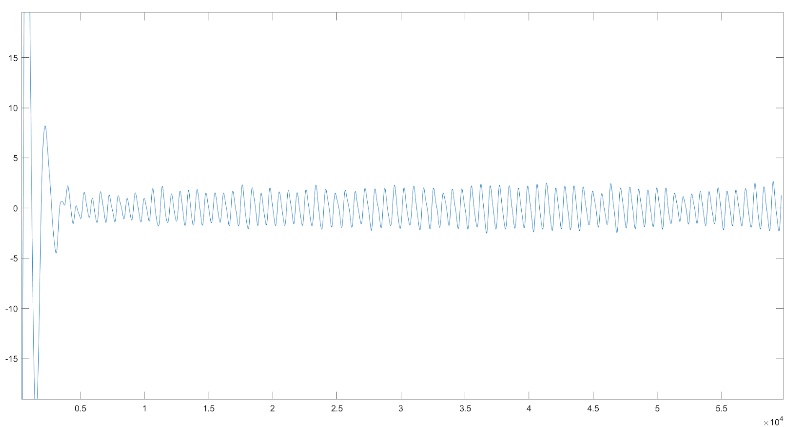
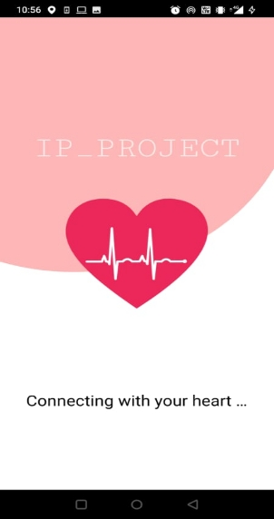
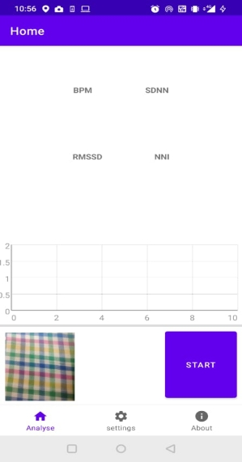
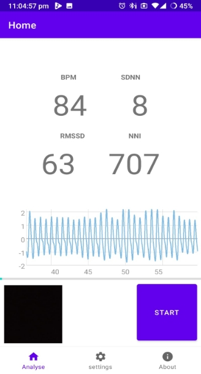


<h1 align = "center">HRV APP</h1>       
<h3 align="center">Guide: Anubha Gupta, Manukumar Shetty</h3>
<h3 align="center">  Authors:- Piyush Sharma(2019070), Saurav Rao(2019271)  </h3>    

**Problem Statement**  
At the turn of the century, cardiovascular diseases (CVDs) became the leading cause of mortality in India. This epidemiological transition is largely because of the increase in the prevalence of CVDs and CVD risk factors in India. In 2016, the estimated prevalence of CVDs in India was estimated to be 54.5 million.1 One in 4 deaths in India are now because of CVDs with ischemic heart disease and stroke responsible for >80% of this burden.1 These diseases tend to affect patients in the most productive years of their lives and result in catastrophic social and economic consequences.

These statistics motivate us to help the general population be more aware about their heart health and make the day to day monitoring of their heart very easily accessible.

Each person's heart rate helps to determine their fitness level and by monitoring this, user will be able to avoid overtraining, which in turn can reduce the risk of heart failures and mental fatigue.

**Introduction**   
We aim to make a mobile application that help users to stay connected with their heart by offering day to day heart rate monitoring to them.

The goal of this project was to build an application that measures heart rate and related parameters using a mobile phone camera.

**Features**    
`Heart rate` :- This is the main feature which the app offers that can be easily understood by anyone using this app. The heart rate is calculated in beats per minute.

`RMSSD` :- The RMSSD is the root mean square of successive differences between normal heartbeats. The reference range for RMSSD would be 13–107ms, which is a pretty broad generalization.

`SDNN`(standard deviation of the NN intervals) :- The SDNN is the gold standard to determine cardiac risk and is used to predict morbidity and mortality. Sympathetic and parasympathetic activities contribute to SDNN.

`NNI` :- Mean of NN intervals, peak-to peak interval

**Methodology For Analysis**    
<h5>Basic Idea</h5>  
Every time your heart beats, the amount of blood that reaches the capillaries in your fingers and face swells and then recedes. Because blood absorbs light, apps are able to capture this ebb and flow by using the flash of your phone's camera to illuminate the skin and create a reflection.

<h5>Constants and Values</h4>

`SAMPLE_SIZE (default 60s)`    
`UNRELIABLE_SIGNAL_DURATION (10s)`

We extract the red intensities from the frames with a frequency of 30fps and call it `signal` array

Timestamp corresponding to every frame is stored in `time` array

<h5>Procedure</h5>
We check if the total duration of the signal is more than SAMPLE\_SIZE and proceed further.

* **Filter**  
  Using 4th order Butterworth Bandpass filter with lower cutoff frequency of `LOW_CO` and higher cutoff frequency of `HIGH_CO`

* **Smoothen**
    * Using triangular mode and window size of 11
    * Trim timestamps to size of smoothened signal
    * Remove first `UNRELIABLE_SIGNAL_DURATION` seconds of signal considering it as corrupt due to smoothening
* **Resample:-**
    * Cubic Spline at 200Hz

Find Peaks index (`peaks`) and calculate intervals and store them `intervals` array

NNI =  mean of `intervals`   
SDNN = Square Root of Variance of `intervals`  
RMSSD =  calculated as root mean square of successive difference of `intervals`  
BPM = Number of peaks for sample of 1 minute

Signal  

Filtered  

Smoothened  

Resampled and peaks  

**UI**

  

**Demo Video:**  

<https://drive.google.com/drive/folders/1NPKYLNTtHYH7jybNfObCLu0NZO1Fwr6u?usp=sharing>

**References**

* <https://blog.google/technology/health/take-pulse-health-and-wellness-your-phone/>

*<https://ieeexplore.ieee.org/document/6864425>
